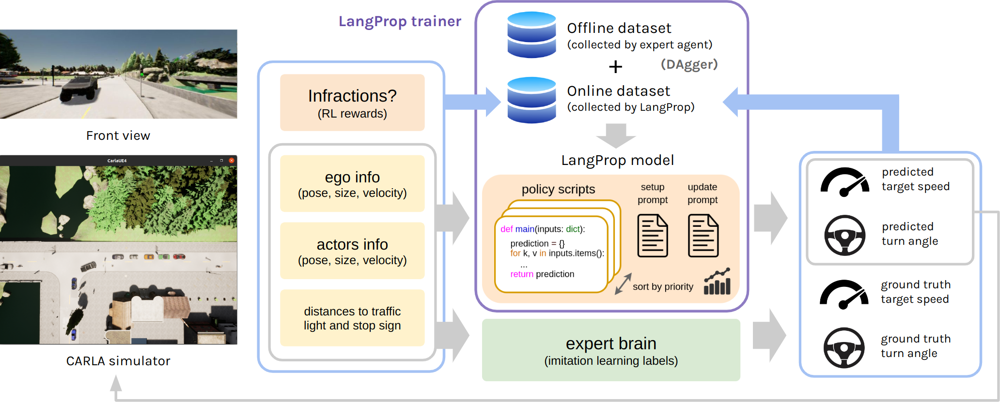

# LangProp: A code optimization framework using Language Models applied to driving


**Paper:** LangProp: A code optimization framework using Language Models applied to driving
**Authors:** Shu Ishida, Gianluca Corrado, George Fedoseev, Hudson Yeo, Lloyd Russell, Jamie Shotton, João F. Henriques, Anthony Hu
- [ICLR 2024 Workshop on Large Language Model (LLM) Agents](https://openreview.net/pdf?id=JQJJ9PkdYC)
- [arXiv](https://arxiv.org/abs/2401.10314)

## About
LangProp is a framework for generating code using ChatGPT, and evaluate the code performance against a dataset of expected 
outputs in a supervised/reinforcement learning setting. Usually, ChatGPT generates code which is sensible but fails for some edge cases, and then you need to go back and prompt ChatGPT again with the error.
This framework saves you the hassle by automatically feeding in the exceptions back into ChatGPT in a training loop, so that ChatGPT can iteratively improve the code it generates.

The framework works similarly to PyTorch Lightning. You prepare the following:
- a PyTorch-like Dataset that contains the input to the code and the expected output (ground-truth labels), 
- a "model" definition of `setup.txt` and `update.txt` where the setup and update prompts are defined,
- a Trainer which defines the scoring metric, data preprocessing step, etc.
  - The scoring metric can be as simple as the accuracy of the prediction, i.e. `float(result == labels)`.
  - The preprocessing step converts the items retrieved from the dataset into input-output pairs.

Then, watch LangProp generate better and better code.


## Setup
1. Install anaconda or miniconda
    ```bash
    conda create -n langprop python=3.7
    conda activate langprop
    pip install -r requirements.txt
    ```
2. Install git
3. Clone the repository
4. Run the setup script
    ```
    bash setup.sh
    ```
5. Set `.env` at the repository root to include the following.
    ```
    export DATA_ROOT_BASE=<PATH_TO_STORAGE>    # for example, ${ROOT}/data/experiments
    ```
    In addition, do one of the following to use LangProp with a pre-trained LLM.

    #### If you are using the OpenAI Endpoint
    ```
    export OPENAI_API_TYPE=open_ai
    export OPENAI_API_BASE=https://api.openai.com/v1
    export OPENAI_API_KEY=<YOUR API KEY>
    export OPENAI_MODEL=gpt-3.5-turbo
    ```
    
    #### If you are using the Azure Endpoint
    ```
    export OPENAI_API_TYPE=azure
    export OPENAI_API_BASE=https://eastus.api.cognitive.microsoft.com
    export OPENAI_API_KEY=<YOUR API KEY>
    export OPENAI_API_VERSION=2023-03-15-preview
    export OPENAI_API_ENGINE=gpt_test
    ```
   
    #### If you want to use a custom LLM
    Override the `call_llm` method in the `LangAPI` class in [./src/langprop/lm_api.py](./src/langprop/lm_api.py). 

## Getting started with LangProp
Please refer to the self-contained code and documentation for the LangProp framework under [./src/langprop](./src/langprop). 

At the start, make sure you add `src` to the `PYTHONPATH` by running
```
export PYTHONPATH=./src/:${PYTHONPATH}
```
### Sudoku
This example solves Sudoku. Instead of solving the standard 3x3 puzzle, we solve a general sudoku that consists of W x H subblocks, each with H x W elements.
Due to the complexity in the specification, an LLM would often fail on the first attempt, but using LangProp allows us to filter out incorrect results and arrive at a fully working solution.

#### Generate training dataset
This only has to be done once to generate the training data.
```
python ./src/langprop/examples/sudoku/generate.py
```

#### Run training loop
```
python ./src/langprop/examples/sudoku/test_run.py
```

The resulting code (which we call checkpoints) and the log of ChatGPT prompts and queries can be found in `lm_logs` in the root directory. 
- [Example prompts](./src/langprop/examples/sudoku/solve_sudoku).
- [Example checkpoint](./src/langprop/examples/sudoku/example_checkpoint).
- [Incorrect solution generated zero-shot](./src/langprop/examples/sudoku/example_checkpoint/incorrect_solution_zero_shot.txt)
- [Correct solution after LangProp training](./src/langprop/examples/sudoku/example_checkpoint/correct_solution_after_langprop.txt)

### CartPole
This example solves `CartPole-v1` in openai gym (now part of gymnasium). Initially the LLM generates solutions which are simplistic and does not balance the CartPole.
With a simple monte carlo method of optimizing the policy for the total rewards, we can obtain improved policies using LangProp.

#### Run training loop
```
python ./src/langprop/examples/cartpole/test_run.py
```

Here is a sample video of the training result:


The resulting code (which we call checkpoints) and the log of ChatGPT prompts and queries can be found in `lm_logs` in the root directory. 
- [Example prompts](./src/langprop/examples/cartpole/solve_cartpole).
- [Example checkpoint](./src/langprop/examples/cartpole/example_checkpoint).
- [Policy generated zero-shot](./src/langprop/examples/cartpole/example_checkpoint/zero_shot_policy.txt)
- [Policy after LangProp training](./src/langprop/examples/cartpole/example_checkpoint/trained_policy.txt)

# LangProp applied to driving in CARLA



The bash scripts used below has been written to work in a Linux environment.

### How to run experiments
1. Start a simulator
   
    Before you start an experiment, make sure that a CARLA process is running. 
    You can start multiple CARLA processes on separate ports if you want to run multiple experiments in parallel.
    
    Example in CARLA ver. 0.9.10 on a headless server (change 910 to 911 for 0.9.11, and remove -opengl to run with a display):
    ```
    ./carla/910/CarlaUE4.sh --world-port=2000 -opengl   # if you want to run multiple CARLA processes, change the port number
    ```
    Occasionally the CARLA process crash. If this happens, terminate the experiment, kill the CARLA process and restart.
    
    If you need to run the CARLA process on a particular GPU, simply set
    ```
    export CUDA_VISIBLE_DEVICES=<GPU ID>
    ```
    on the terminal before running the CARLA command.

2. In a separate terminal, run the following
    ```
    cd <ROOT directory>
    conda activate langprop
    export PORT=2000           # 2000 by default, change if you are connecting to a simulator on a different port
    export GPU=<GPU ID>        # optional. Set it if you want to use a GPU other than GPU_0. Alternatively you can set CUDA_VISIBLE_DEVICES.
    ```
3. In the same terminal, set one of the following depending on which route you want to use for the run
   1. Training routes (standard setting)
       ```
       . ./scripts/set_training.sh
       ```
   2. Testing routes (evaluation of experts and pretrained methods)
       ```
       . ./scripts/set_testing.sh
       ```
   3. Longest6 benchmark (evaluation of experts and pretrained methods)
       ```
       . ./scripts/set_longest6.sh
       ```
   This will set the Python path to include necessary CARLA and LangProp packages, as well as set the environment variables for the `ROUTES` and `SCENARIOS`.

4. #### If this is the first time you are setting up your experiments
   Run the data collection script, one for the training routes and one for the test routes.
   ```
   bash scripts/data_collect/expert.sh <RUN_NAME>
   ```
   The results will be saved under `<DATA_ROOT_BASE>/langprop/expert` where `DATA_ROOT_BASE` is the path you have specified in `.env` during the setup.
   You can provide an optional run name (has to be a valid folder name with no spaces) to make your experiment more findable. By default, all experiments will be saved in a folder with the format `data_%m%d_%H%M%S`.

   After the data collection runs have finished, move / copy the runs to the paths `<DATA_ROOT_BASE>/langprop/expert/training/offline_dataset` and `<DATA_ROOT_BASE>/langprop/expert/testing/offline_dataset`. This will be used to train and evaluate LangProp driving policies. Alternatively, search through the repository and change the paths which include `/offline_dataset` to the paths to your training and testing datasets.

5. Run one of the following depending on the experiments you want to run, 

   #### Run our expert (either for data collection or for evaluation)
   ```
   bash scripts/data_collect/expert.sh <RUN_NAME>
   ```
   The run name is optional and can be given to make the experiment more discoverable. (Same with the following sections)
   
   #### Evaluate third-party experts
   ```
   # Roach
   bash scripts/eval_expert/roach_expert.sh <RUN_NAME>
   # TCP
   bash scripts/eval_expert/tcp_expert.sh <RUN_NAME>
   # TransFuser
   bash scripts/eval_expert/tfuse_expert.sh <RUN_NAME>
   # InterFuser
   bash scripts/eval_expert/interfuser_expert.sh <RUN_NAME>
   # TF++
   bash scripts/eval_expert/tfuseplus_expert.sh <RUN_NAME>
   ```
   
   #### Train the online or DAgger LangProp agent
   ```
   # set this environment variable only if you want to train the LangProp agent only on the online replay buffer
   # export ONLINE_ONLY=true
   
   # set this environment variable only if you want to train the LangProp agent without the infraction updates
   # export IGNORE_INFRACTIONS=true
   
   bash scripts/data_collect/lmdrive.sh <RUN_NAME>
   ```
   The trained LangProp checkpoints will be saved in the route directories under `lm_policy/ckpt`. 
   
   #### Evaluate LangProp agent
   Navigate to the last checkpoint in the most recent route (in `<EXPERIMENT_DIR>/<ROUTE_DIR>/lm_policy/ckpt/<STEP>_batch_update/predict_speed_and_steering`) and set the policy checkpoint path to this entire path (finishing with `predict_speed_and_steering`). 
   ```
   export POLICY_CKPT=<CHECKPOINT_DIR>
   bash scripts/data_collect/lmdrive_eval.sh <RUN_NAME>
   ```

All evaluation results are stored in the `summary.json` file under each experiment directory.

### Training a LangProp driving policy offline
To train the LangProp policy offline, we don't need a CARLA simulator running in the background. Make sure that you have prepared the offline training and testing datasets using the expert agent following the section "If this is the first time you are setting up your experiments".
Then run
```
. set_path.sh    # setting the Python Path
python ./src/lmdrive/run_lm.py
```
By default, this will save the resulting logs and checkpoints in `<DATA_ROOT_BASE>/langprop/lmdrive_offline`. 

### Viewing training curves
The training statistics are logged in Weights and Biases. The URL to the log will be available within the experiment terminal.

### If your experiment crashes mid-way
1. Kill and restart your CARLA process corresponding to the experiment (they should share the same PORT)
2. If you have to restart your experiment terminal, make sure that you've followed all the necessary steps setting up the environment variables (e.g. routes and ports).
3. Find the experiment directory and set `export RUN_NAME=<DIRECTORY_NAME>` to the name of the experiment directory. 
4. If you are training the LangProp agent, 
   1. Delete the last sub-folder (for individual routes) in your unfinished experiment. This is to make sure that this incomplete route won't be loaded into the replay buffer and that the experiment resumes from the most recent complete route.
   2. Navigate to the last checkpoint in the most recent complete route (in `<EXPERIMENT_DIR>/<ROUTE_DIR>/lm_policy/ckpt/<STEP>_batch_update/predict_speed_and_steering`) and set `export POLICY_CKPT=<CHECKPOINT_DIR>` to this entire path (finishing with `predict_speed_and_steering`). 
5. Resume your experiment by running `bash scripts/<whichever_experiment_you_were_running>.sh`.

### Save video
   Go to the experiments folder that saves the images and run, for example
   ```
   ffmpeg -framerate 10 -i debug/%04d.jpg outputs.mp4
   ```

### Watch video
   Videos of sample runs can be found in [videos](./videos). Make sure that you have pulled from Git LFS first via `git lfs pull`.

### Pre-trained model checkpoints
   Pre-trained checkpoints can be found in [checkpoints](./checkpoints). We provide checkpoints for LangProp trained offline, DAgger with IL (imitation learning), DAgger with both IL and RL (reinforcement learning), and online with both IL and RL.
   You can evaluate them by running the [evaluation commands](https://github.com/langprop-iclr24/LangProp/tree/main#evaluate-langprop-agent):
   ```
   export POLICY_CKPT=<CHECKPOINT_DIR>
   bash scripts/data_collect/lmdrive_eval.sh <RUN_NAME>
   ```

### (Optional) Download third-party weights
Weights for RGB-based agents by TCP and InterFuser can be downloaded from their respective repositories.
#### TCP
Download the model from a [OneDrive link](https://hkustconnect-my.sharepoint.com/:u:/g/personal/qzhangcb_connect_ust_hk/ETe4OX79JldIsvgNGIs5NmIBkJnfPDG2G5Ij-8ha518rOw?e=BG1dek) and place it in `./weights/tcp/TCP.ckpt`.
This link was obtained from https://github.com/OpenDriveLab/TCP/issues/11. 

#### InterFuser
Download the model from [here](http://43.159.60.142/s/p2CN) and place it in `./weights/interfuser/interfuser.pth.tar`.
This link was obtained from the [official repository](https://github.com/opendilab/InterFuser#pretrain-weights).

## Third-party baselines
Third party baselines are cloned into the repository as git submodules. The evaluation scripts are under the [./scripts/eval_expert](./scripts/eval_expert) directory.

- [Carla Garage: Hidden Biases of End-to-End Driving Models
](https://github.com/autonomousvision/carla_garage)
- [InterFuser: Safety-Enhanced Autonomous Driving Using Interpretable Sensor Fusion Transformer
](https://github.com/opendilab/InterFuser)
- [TCP - Trajectory-guided Control Prediction for End-to-end Autonomous Driving: A Simple yet Strong Baseline
](https://github.com/OpenPerceptionX/TCP)
- [MILE: Model-Based Imitation Learning for Urban Driving](https://github.com/wayveai/mile)
- [TransFuser: Imitation with Transformer-Based Sensor Fusion for Autonomous Driving
](https://github.com/autonomousvision/transfuser)
- [CARLA-Roach
](https://github.com/zhejz/carla-roach)

More details on the baselines can be found in [baselines.md](./src/baselines/README.md).
To run the baselines, refer to the `README.md` files under the [./3rdparty](./3rdparty) submodules.

## Further details
### Setting up CARLA and the offline leaderboard
- https://leaderboard.carla.org/get_started_v1/

### Submitting an agent to leaderboard 1.0
- https://leaderboard.carla.org/submit_v1/

## Citation

If you find our work useful, please cite our work as follows:
```
@inproceedings{
ishida2024langprop,
title={LangProp: A code optimization framework using Large Language Models applied to driving},
author={Shu Ishida and Gianluca Corrado and George Fedoseev and Hudson Yeo and Lloyd Russell and Jamie Shotton and Joao F. Henriques and Anthony Hu},
booktitle={ICLR 2024 Workshop on Large Language Model (LLM) Agents},
year={2024},
url={https://openreview.net/forum?id=JQJJ9PkdYC}
}
```

## Acknowledgements
This implementation is based on code from several repositories.
- [CARLA Leaderboard](https://github.com/carla-simulator/leaderboard)
- [Scenario Runner](https://github.com/carla-simulator/scenario_runner)
- [Carla Garage: Hidden Biases of End-to-End Driving Models
](https://github.com/autonomousvision/carla_garage)
- [InterFuser: Safety-Enhanced Autonomous Driving Using Interpretable Sensor Fusion Transformer
](https://github.com/opendilab/InterFuser)
- [TCP - Trajectory-guided Control Prediction for End-to-end Autonomous Driving: A Simple yet Strong Baseline
](https://github.com/OpenPerceptionX/TCP)
- [MILE: Model-Based Imitation Learning for Urban Driving](https://github.com/wayveai/mile)
- [TransFuser: Imitation with Transformer-Based Sensor Fusion for Autonomous Driving
](https://github.com/autonomousvision/transfuser)
- [CARLA-Roach
](https://github.com/zhejz/carla-roach)
